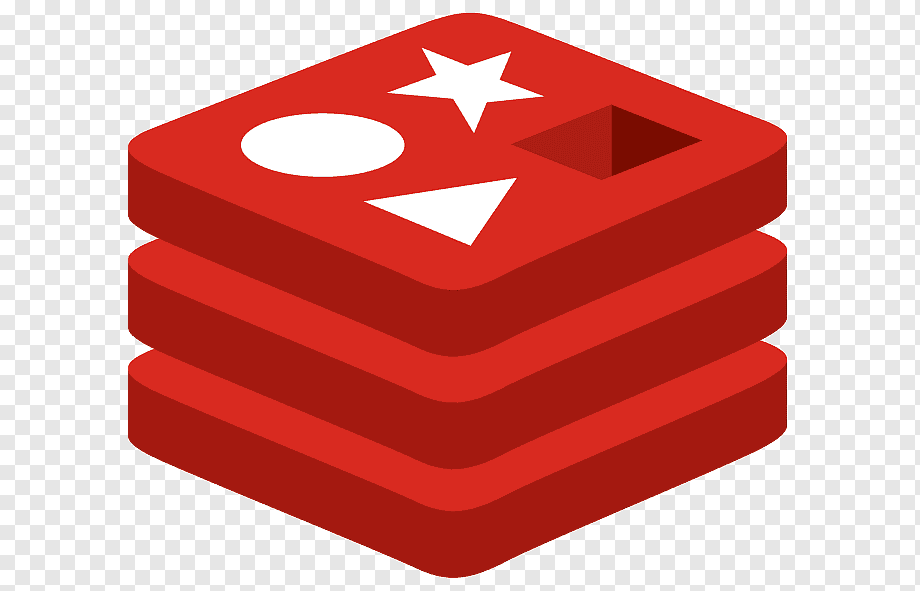

<h2 align="center">Hi there, I'm Furkan</h2> 

- 🔭 I’m currently working on chat project.
- 💬 Ask me about Python, Django, FastAPI, Vue, Git, Docker. Kubernetes, Rancher. 

### <b> Connect with me:</b>

  
  
 

<h2 align="left" id="macropower-tech">🔨 Languages and Tools: </h2>

<table>
  <tr>
    <td align="center" width="96">
      
       HTML5
    </td>
    <td align="center" width="96">
      
       CSS3
    </td>
    <td align="center" width="96">
      
       JavaScript
    </td>
    <td align="center" width="96">
      
       Bootstrap
    </td>
    <td align="center" width="96">
      
       Vue
    </td>
  </tr>
  <tr>
    <td align="center" width="96">
      
       Python
    </td>
    <td align="center" width="96">
      
       Django
    </td>
    <td align="center" width="96">
      
       FastAPI
    </td>
  </tr>
  <tr>
    <td align="center" width="96">
      
       Git
    </td>
    <td align="center" width="96">
      
       Docker
    </td>
    <td align="center" width="96">
      
       Kubernetes
    </td>
    <td align="center" width="96"> 
      
       Rancher
    </td>
     <td align="center" width="96"> 
      
       Longhorn
    </td>
  </tr>
  <tr>
    <td align="center" width="96">
      
       MongoDB
    </td>
    <td align="center" width="96">
      
       PostgreSQL
    </td>
     <td align="center" width="96">
      
       Redis
    </td>
    <td align="center" width="96">
      
       AWS
    </td>
    <td align="center" width="96">
      
       Jenkins
    </td>
  </tr>
</table>

 

### 📕 Latest Blog Posts

- [Helm Nedir, Nasıl Kullanılır ?| Kubernetes Dersler 4](https://furkanozkaya.com/devops/helm-nedir-nasil-kullanilir/)
- [Kubernetes Yaml Dosyası Nasıl Yazılır ? | Kubernetes Dersleri 3](https://furkanozkaya.com/devops/kubernetes/kubernetes-dersleri/kubernetes-yaml-dosyasi-nasil-yazilir/)
- [Kubernetes Servisleri Pending Hatası Nasıl Çözülür ? MetalLB](https://furkanozkaya.com/devops/kubernetes/kubernetes-servisleri-pending-hatasi-nasil-cozulur-metallb/)

➡️ [more blog posts...](https://furkanozkaya.com)

 

  
 GitHub Activity Graph

    
  

 

  
 GitHub Stats

  

 

  
 GitHub Metrics

  

 
 

### <b> See Online Resume </b>

  

  

